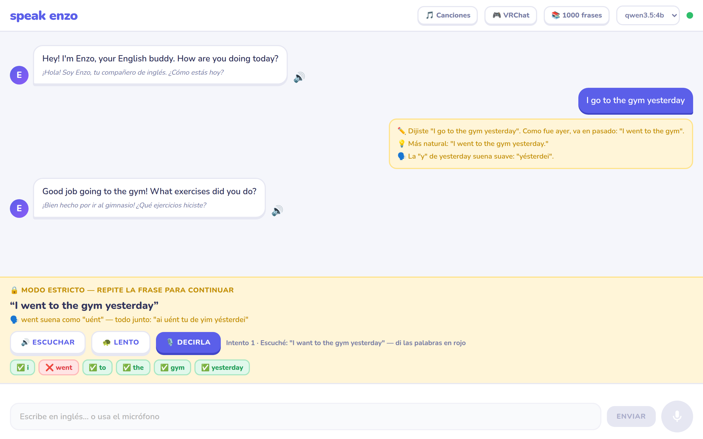
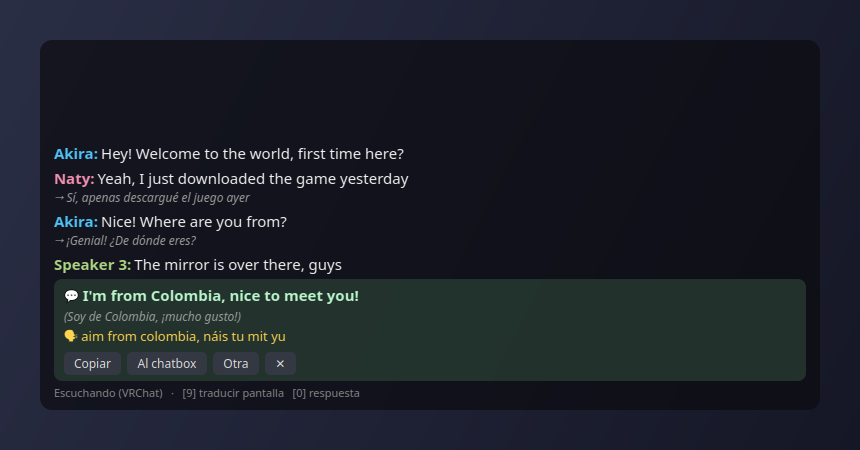
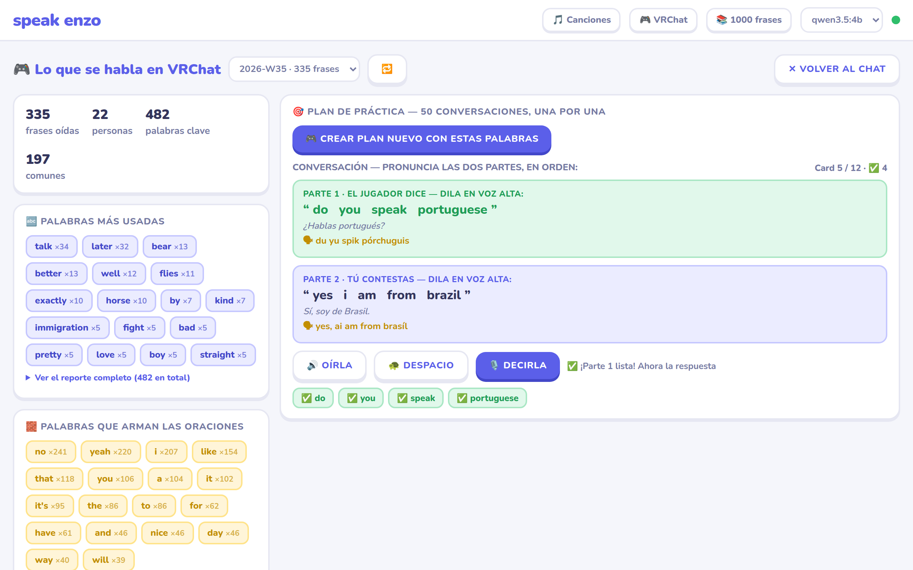
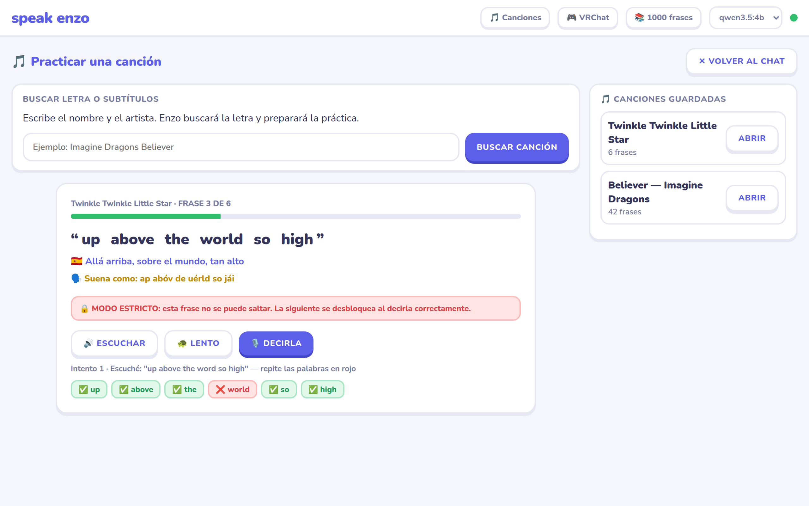
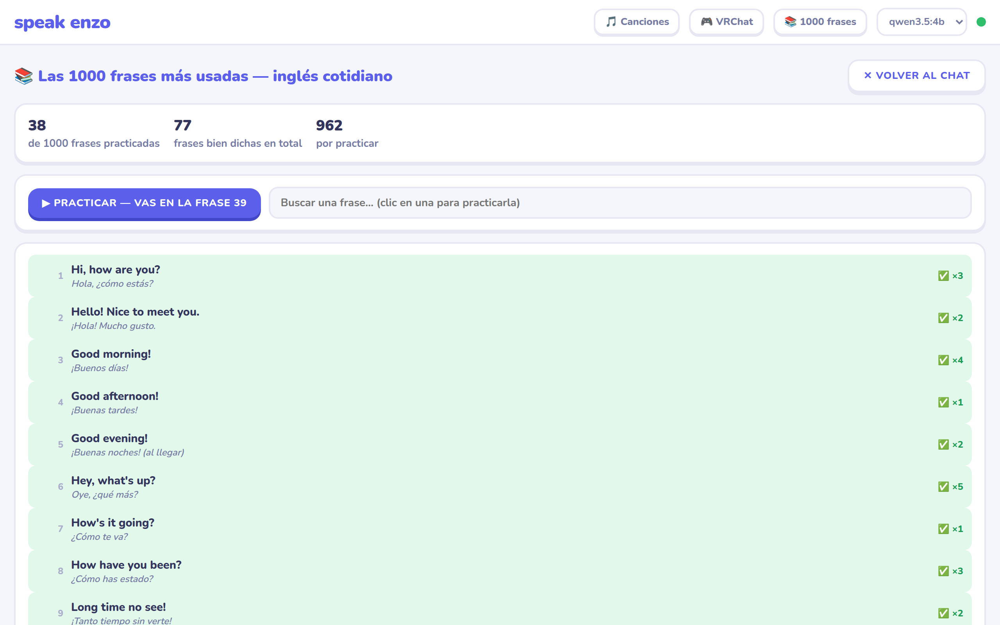
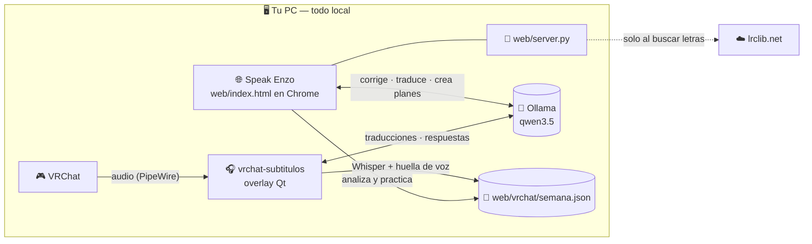

<div align="center">

# 💙 Speak Enzo

### Aprende inglés hablando — con una IA que corre 100 % en tu PC

Conversa con **Enzo**, tu tutor de inglés con voz: te corrige la gramática,
te enseña a pronunciar con fonética "en español" y **no te deja avanzar
hasta que lo digas bien**. Y si juegas **VRChat**, te pone subtítulos en
tiempo real y convierte todo lo que escuchaste en material de práctica.


**Sin cuentas · Sin claves de API · Sin mensualidades · Tus conversaciones no salen de tu máquina**

</div>

---

## 🚀 Arrancar (un solo comando)

```bash
./start.sh
```

Eso es todo. El script instala lo que falte ([Ollama](https://ollama.com) y un
modelo de IA si no tienes), arranca la IA, sirve la web en
**http://localhost:8180** y abre el navegador.

> **Usa Google Chrome**: el reconocimiento de voz del micrófono solo funciona ahí.

Para los subtítulos de VRChat hay un segundo comando, también auto-instalable:

```bash
./vrchat-subtitulos/vrchat-subtitulos     # o simplemente: vrchat-subs
```

---

## 💬 Habla con Enzo (y el modo estricto 🔒)

Hablas por el micrófono (o escribes) y Enzo te responde en inglés, con voz y
con la traducción al español debajo. Cada mensaje tuyo recibe:

- ✏️ **Corrección de gramática**, explicada en español.
- 💡 **Una forma más natural** de decir lo que intentaste.
- 🗣️ **Un consejo de acento** cuando hablaste por voz.

Y aquí viene lo importante — el **modo estricto**, siempre activado: si
cometes un error, Enzo te da la frase correcta y cómo pronunciarla… y **la
conversación se bloquea hasta que la digas bien en voz alta**. Cada intento
te marca palabra por palabra en verde ✅ y rojo ❌. Tras 4 intentos aparece
la salida de emergencia ("continuar de todos modos").



El micrófono es **manos libres**: cuando Enzo termina de hablar, se enciende
solo y te escucha. Puedes pasar una conversación entera sin tocar el teclado.

---

## 🎮 VRChat: subtítulos en el juego + práctica con lo que escuchaste

La joya del proyecto: un ciclo completo entre **jugar** y **aprender**.

### 1. Mientras juegas — subtítulos en tiempo real

`vrchat-subs` pone una ventana flotante sobre el juego que subtitula
**en inglés** a las personas que hablan en VRChat:



*(La ventana real del overlay, renderizada con una conversación de ejemplo.)*

- 🗣️ **Cada persona por separado, identificada por su voz** (huella de voz):
  VRChat entrega todas las voces mezcladas, así que la app las distingue por
  cómo suenan. Les pones nombre una vez (doble clic) y las recuerda para
  siempre, con su color propio.
- 🇪🇸 **Traducción al español a demanda**: seleccionas frases como en el
  navegador (clic apretado + barrer + soltar) y se traducen solo esas. O la
  **tecla 9** (¡funciona dentro del juego!) traduce lo que hay en pantalla.
- 💬 **Respuesta sugerida**: un clic sobre la conversación (o la **tecla 0**)
  y la IA local te propone qué contestar en inglés, con su traducción y su
  pronunciación escrita "en español" (*How are you today?* → `jau ar yu tudéi`).
  Botones para **copiarla** o **mandarla al chatbox de VRChat** por OSC.
- 🔇 Solo subtitula voces cercanas/fuertes; el murmullo lejano se ignora.
- 🎧 Captura únicamente la **salida** de audio de VRChat (PipeWire), nunca tu
  micrófono. Whisper corre en tu GPU, o en CPU si el juego la tiene ocupada.

Todos los detalles (teclas, menú, configuración, modo VR con visor):
**[vrchat-subtitulos/README.md](vrchat-subtitulos/README.md)**.

### 2. Después de jugar — practica lo que oíste

Todo lo que escuchaste se guarda **en tu disco, por semana**. El botón
**🎮 VRChat** de la web lo analiza (palabras más usadas, expresiones
repetidas) y la IA crea un **plan de 50 mini-conversaciones** con ese
vocabulario real: el "jugador" dice algo típico y tú contestas — pronunciando
**las dos partes en voz alta**, en modo estricto:



Así practicas exactamente el inglés que se habla en los mundos que visitas.

---

## 🎵 Canciones

Busca cualquier canción por título y artista (catálogo de letras de
[lrclib.net](https://lrclib.net)). Enzo traduce cada frase, le escribe su
pronunciación, y te guía **frase por frase**: escuchas, repites, y la
siguiente solo se desbloquea cuando la pronuncias bien. Sin botón de saltar.



Las canciones preparadas quedan guardadas localmente para retomarlas donde ibas.
Puedes hacer clic en cualquier palabra de la frase para escucharla y
practicarla suelta.

---

## 📚 Las 1000 frases

Las 1000 frases más usadas del inglés cotidiano, ordenadas por temas
(saludos, restaurante, trabajo, viajes…), con traducción y fonética. Se
practican una por una en modo estricto, y la app lleva la cuenta de cuántas
veces has dicho bien cada una:



---

*Las capturas son de la app real corriendo, con conversaciones de ejemplo.*

## 🧠 Cómo funciona por dentro

Todo corre en tu máquina. El navegador habla directo con Ollama; el overlay
de VRChat procesa el audio localmente y deja las frases donde la web las lee:



| Pieza | Tecnología |
|---|---|
| Cerebro (correcciones, traducciones, planes) | [Ollama](https://ollama.com) con `qwen3.5:4b` (o el modelo que elijas), respuestas en JSON forzado |
| Oídos en el juego | [faster-whisper](https://github.com/SYSTRAN/faster-whisper) (transcripción) + Silero VAD (detecta voz) + NeMo TitaNet (huella de voz) |
| Voz de Enzo | Síntesis de voz del navegador (`speechSynthesis`) |
| Tu micrófono en la web | Reconocimiento de voz de Chrome (Web Speech API) |
| Overlay del juego | Python + PySide6 (Qt), captura por PipeWire, chatbox por OSC |
| La web | Un solo `index.html` en JavaScript vanilla — cero dependencias, cero build |

---

## ✅ Requisitos

> ⚠️ **Este proyecto es SOLO para Ubuntu** (y derivados con `apt`).
> No funciona en Windows ni macOS: los scripts usan `apt-get`, PipeWire y
> rutas de Linux.

| Necesitas | Para qué |
|---|---|
| **Ubuntu 22.04+** (o derivado) | Todo el proyecto |
| **Google Chrome** | El micrófono de la web (reconocimiento de voz) solo funciona en Chrome |
| ~4 GB de disco | Modelo de IA `qwen3.5:4b` + modelo Whisper (se descargan solos la primera vez) |
| GPU NVIDIA *(opcional)* | Subtítulos de VRChat más rápidos; sin GPU funciona en CPU automáticamente |
| VRChat corriendo en Linux *(opcional)* | Solo para la parte de subtítulos del juego |

---

## 🔐 Privacidad

- Tus conversaciones con Enzo, las correcciones, traducciones y planes de
  práctica los genera **Ollama en tu PC**. Nada de eso se sube a ningún lado.
- El audio de VRChat se transcribe **localmente** (Whisper en tu máquina) y
  las frases quedan solo en tu disco (`web/vrchat/`, que además está en
  `.gitignore`: nunca entra al repositorio).
- Lo único que sale de tu PC: la **búsqueda de letras** (se envía título y
  artista a lrclib.net), las **descargas iniciales** de Ollama y los modelos,
  y la voz de tu **micrófono en la web**, que transcribe el servicio de voz
  del propio Chrome (como cualquier dictado del navegador).

---

## 📁 Estructura del repositorio

```
enzo-speak/
├── start.sh                 ⭐ arranca todo (IA + web + navegador)
├── web/                     la app: UNA página, sin dependencias
│   ├── index.html           toda la interfaz y la lógica
│   ├── server.py            servidor local (estáticos + búsqueda/guardado de canciones)
│   ├── frases1k.js          las 1000 frases con traducción
│   ├── songs/               (solo local, no se sube) canciones preparadas
│   └── vrchat/              (solo local, no se sube) lo que escuchaste, por semana
├── vrchat-subtitulos/       🎧 subtítulos en tiempo real para VRChat
│   ├── vrchat-subtitulos    ⭐ ejecutable auto-instalable
│   └── app/                 captura, VAD, hablantes, Whisper, IA, OSC, overlay
├── backend/                 versión anterior con FastAPI (pausada, no se usa)
└── docs/capturas/           las imágenes de este README
```

---

## 🛠️ Problemas comunes

| Síntoma | Solución |
|---|---|
| El micrófono no hace nada | Usa **Google Chrome** y permite el micrófono cuando lo pida. En Firefox/otros no hay reconocimiento de voz. |
| "No encuentro Ollama" en la web | `./start.sh` lo arranca solo; si falla, mira `/tmp/speak_enzo_ollama.log` o ejecuta `ollama serve` a mano. |
| El puerto 8180 está ocupado | Cierra el programa que lo usa y vuelve a ejecutar `./start.sh`. |
| Enzo tarda mucho en responder | Cambia al modelo pequeño (`qwen3.5:2b`) en el selector de arriba a la derecha: `ollama pull qwen3.5:2b`. |
| Subtítulos lentos con el juego abierto | Normal: si VRChat llena la GPU, Whisper pasa a CPU (~1 s por frase). Puedes probar `vrchat-subs --model tiny`. |
| Subtitula murmullos lejanos (o no oye a alguien) | Ajusta `min_volume` en `~/.config/vrchat-subtitulos/config.json` (súbelo a `0.02` para ser más estricto, bájalo a `0.008` para oír más lejos). |

---

<div align="center">

Hecho con 💙 para aprender inglés jugando.

</div>
